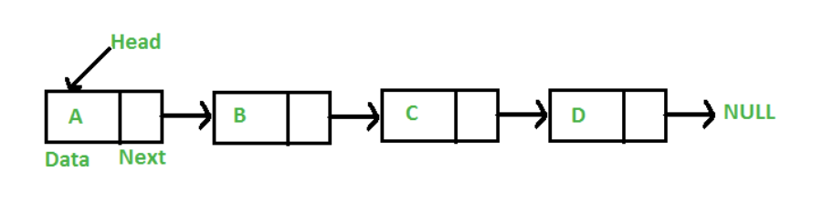

## Introduction 

### So far: only data structure is array 

- Two ways to use an array 

    - Static fixed-size array: compile-time known size 
        ```
        int a[100]; 
        ```
    - Dynamically allocated fixed-size array: 
        ```
        int n; 
        cin >> n; 
        int* b = new int[n]; //b will be a pointer to the first element of the array 
        ```
        - You can't during execution later on change the size of the array 

- Another way to use an array: resizable array 

    - Make it look like the array is as big as you need it to be 

    - Done typically inside a class 
        ``` 
        Object {
            pointer to some dynamically allocated array
            size = 3; how many elements you are actually using 
            CAP = 5; indication of the capacity of the array 
        }

        operation add {
            if size is less than CAP --> there is room
            once we put one more, failure...
        }
        ```
    - Resizable array 

        - If there is room, put element in dynamic array 
        - If there is no room, allocate a new array 

            - Go through old array and store everything into new array, update pointer, update capacity
            - Delete old array 
    
    - In the standard library: **vector** 

- Common property for all array-like random structures: consecutive storing of elements 

    - Advantage 

        - Quick random access `a[3]`
            - Compiler knows: location of array `a` + type of element 

                - e.g. if type is double --> 8 bytes, then compiler just does 
                `1000 + 8*k` for `a[k]` 

            - trivial calculation 

    - Disadvantage 
        
        - Costly insertion/removal for ordered elements 

            - Exception: insertion/removal at the end 

                - delete/add one, change size -> cheap operation 

                - do this when your items do not have to be ordered 

            - If you want to add a new item between consecutive elements -> shift all elements to make room for insertion/removal 

            - Insertion/removal near the beginning much more costly than end 

---

## Linked List 

> Goal: represent a collection of values for which inserting and removing items preserves the order of the other items, but is efficient even if the insertions are not at the end

- What if we don't require elements be stored one right after the other? (as in an array)

- Linked List General Idea

    - We can store each item in random addresses, we only follow the arrows
    - We have each item store its own value + a pointer to the next item 
    - To insert: change the pointer of the previous item to point to new item, have new item's pointer point to next item
    - To remove: delete item's pointer, have previous item's pointer point to next item 
    - To print: visit each item through the previous item, stop until we reach the `nullptr` 
        
        - Our last item should point to the `nullptr` successor 
        - To know our first item, we need a pointer variable `head` that points to the first item of the list 
    - A list with no items: `head` points to the `nullptr` 

    

> When working with linked lists, draw pictures!! 

### Using a Linked List Code 

- Declaration of `Node` 

    ```
    struct Node
    {
        int value; //value associated with the node 
        Node* next; //pointer to the next node
    };

    Node* head; //pointer to the first node
    ```

    - `Node* next`: this is legal because compiler knows Node once it gotpass first line, and it knows the size of a pointer that is enoughinformation 
    - `Node next`: this is ILLEGAL

        - how big is a node? size of Node = size of Node + size of int -->infinite
    
- Print the list in "order" 

    - Idea 1 : while our head is not the nullptr, we print out the head'svalue and advance the head to the next

        ```
        while (head != nullptr)
        {
            cout << head-> value << endl; 
            head = head -> next; 
        }
        ```

        - Code trace: we keep keep keep moving head until head is advanced tothe nullptr, everything is printed 

            - head now points to a `nullptr` 
            - PROBLEM: **memory leak**, lost access to the linked listbecause `head` is not pointing to the "first" node anymore, it ispointing to a null pointer 

                - if we can't get to the first node, we can't get to *any*node

    - **Idea 2**: We don't change the `head` pointer, we use another pointervariable that is initialized to the `head` pointer 

        ```
        for (Node* p = head; p != nullptr; p = p->next)
        {
            cout << p->value << endl; 
        }
        ```
        - Code trace: we keep keep keep moving `p` until it points to the`nullptr`, leaves loop, local variable destroyed

            - Works for this case AND for a list with 1 item

        - Note: in the for loop, do not write `p++`!!

            - the `++` operators on pointers are only well defined if thepointer is pointing into an array 

            - this is undefined behavior

            - likely, if a node is x bytes, advance `p` by x bytes --> youdon't know what is stored in this here --> some garbage value orrandom memory locations 

        - Note: whenever you write `p-> ...`, makesure: 

            - `p` is not uninitialized 
            - `p` is not a `nullptr` 

- Element Accessing (find the first occurrence of a value)

    - Idea 1: find the first occurence of 18 in the list, then exit loop
    
        ``` 
        Node* p; 
        for (p = head; p->value!=18; p=p->next)
        {
            ; //empty statement, do nothing 
        }
        ```
        - Problem:

            - "find *the* first node that is 18" implies existence, there isa node with 18

                - what about the possibility that the list does not contain18?

            - can I be sure `p` is uninitialized and not null? 

                - for the empty list: `head` is pointing to nullptr, `p` isreaching for a null pointer 
                - end of list: null pointer as well, if `p`'s previous valueis pointing to the last node, then we will get the nullptr,and try to follow the null pointer 
                - we are going to have a problem if the list does not have an18 
    
    - Idea 2: Make sure that p is not the null pointer

        ```
        for (p = head; p->value != 18 && p!=nullptr; p=p->next) 
        ```
        - if `p` is a `nullptr`, this will be false -> get out of loop with`p` pointing to the null pointer 
        - if before we get to the `p!=nullptr` statement, `p` is already anullptr and we follow a nullptr when checking `p->value != 18` -->that's undefined behavior 
    
    - **Idea 3**: Check for `p` being a nullptr **first**

        ```
        for (p = head; p != nullptr && p->value !=18; p = p->next)
        {
            ;
        }
        ```
- Insertion (after a specified value) 

    - **Idea 1**: Insert a node of value 54 after the 18 in the list, ifpresent 

        - Check if only `p` is not a nullptr (if nullptr, then 18 is notpresent), now we know that `p` is a pointer to the `18` node 

        - Somewhere in memory create a new node 
        
        - Put it in value 54 
        - Set 54 pointer to point to 42 (original node that 18 points to)

        - Change 18 node pointer to point to 54 


        ```
        if (p != nullptr)
        {
            Node* newGuy = new Node; //dynamically allocate a new node objectsomewhere in memory, newGuy will be pointer variable pointing tothis node 
            newGuy->value = 54; //set value 
            newGuy->next = p->next; //we first set newGuy's pointer value 
            p->next = newGuy; //now we have pointer  
        }
        ```
        - if we do: 

            ```
            p->next = newGuy; 
            newGuy->next = p->next;
            ```
            We would effectively be setting newGuy's next pointer to point toitself -> infinite, and memory leak for the rest of the list 
        
        - when we leave the curly braces:

            - the local variable `newGuy` is destroyed 

            - we do not need to `delete` anything manually because thedynamically allocated node is what we inserted, the pointer justgets deleted automatically 
        
        -note: the **right order** 

- Insertion at the end (node 18 is the last node) 

    - Works the same! 

        ```
        if (p != nullptr)
        {
            Node* newGuy = new Node; 
            newGuy->value = 54; //set value 
            newGuy->next = p->next; //newGuy's pointer for nullptr 
            p->next = newGuy; //now we have pointer  
        }
        ```
    
- Remove a node after a node (get rid of the node after the 18 node)

    - We can't do:

        - First set `p`'s next to 42 (`p->next->next`)
        - We now lost access to the 54 node, can't delete it
        
    - We also can't do: 

        - First delete the 54 node (`p->next`)
        - We now lost access to the 42 node, can't make 18 node point to it 

    - Idea 1: 

        - Save 54 node pointer into some local variable, so we have avariable pointing to 42, delete 54 node, store local variable into 18 

    - **Idea 2**: 

        - Save a pointer to the 54 node
        - Change `p`'s next to point to the 42 
        - delete the 54 node 
    
        ```
        Node* toBeDeleted = p->next; //hang on to the 54 node 
        p->next = toBeDeleted->next; //or p->next->next is fine too 
        delete toBeDeleted; 
        ```

- Remove the node itself (remove node 18)

    - We can't follow a pointer backward in a singly-linked list 

    - Method 1: Find the node before the 18 

        - Idea: 

            - The node before 18 points to the same node that `p` points to(`p` is the node we found) 

            - Write another loop that starts from the beginning to check isyour next pointer the same value 

            - Once we found this node, we delete node 18 
    
    - Method 2: Two pointer variables 

        - Idea: 

            - `p` and another pointer variable that is following it 

            - whenever you are ready to advance `p`, you store `p`'s valueinto the variable following `p`, then advance `p`, repeat 

                - one pointer follows the other 

            - once `p` is in the right place, the pointer following it is theone before 

- Remove the node itself at the front of the list (Special Case)

    - We can't find a node before the first node, there is no node before it

    ```
    //check if first node
    head = p->next; 
    delete p; 
    ```

### Linked List Class Implementation 
```
struct Node
{
    string value; 
    Node *next; 
}
```
The only member variable we need is a head pointer 
```
class LinkedList
{
    public: 
        LinkedList(); 
        void addToFront(string v); 
        void addToRear(string v); 
        void deleteItem(string v); 
        bool findItem(string v); 
        void printItems(); 
        ~LinkedList(); 
    private: 
        Node *head; 
};
```
Constructor: create an empty list (head pointer to nullptr)
```
LinkedList()
{
    head = nullptr; 
}
```
Print Items in a List: loop through each of the nodes and print out values, starting with node pointed to by `head` 

**Linked List Traversal**
```
void printItems()
{
    //Use a node pointer 
    Node *p; 
    p = head; //p points to 1st node 

    while (p != nullptr)
    {
        cout << p->value << endl; 
        p = p->next; 
    }
}
```
**Add an Item to a List**

Add at top 
```
void addToFront(string v)
{
    //allocate new node 
    Node *p; 
    p = new Node; 

    p->value = v; //set value

    //Link new node to current top node 
    p->next = head; 

    //Update head pointer to new top node 
    head = p; 
}
```
Add at rear 

- Two cases: 

    - Empty list: same as adding new node to front

    - Non-empty list: traverse down links until we find the current last node 

        - Use a `temp` variable to traverse to current last node 

        - Allocate a new node, set value in node 

        - Link the current last node to new node

        - Link last node to nullptr 
```
void addToRear(string v)
{
    if (head == nullptr)
    {
        addToFront(v); 
    }
    else
    {
        Node *p; 
        p = head; //start at top node 
        while (p->next != nullptr)
        {
            p = p->next; 
        }
        Node *n = new Node; 
        n->value = v; 
        p->next = n; 
        n->next = nullptr; 
    }
}
```
Add Anywhere 

- Several Cases: 

    - If empty list: `addToFront()`
    
    - If new node belongs at top of list (sorted etc.): `addToFront()`

    - If new node belongs in middle of list 

        - Use a traversal loop to find the node just ABOVE where you want to insert your new item 

        - Allocate and fill new node 

        - Link new node into list right after the ABOVE node 

```
void AddItem(string newItem)
{
    if (head == nullptr)
    {
        AddToFront(newItem); 
    }
    else if (/*decide if new item belongs at the top*/)
    {
        AddToFront(newItem); 
    }
    else //new node belongs somewhere in the middle 
    {
        Node *p = head; 
        while (p->next != nullptr)
        {
            if (/*p points just above where to insert*/)
            {
                break; 
            }
            p = p->next; 
        }
        Node *latest = new Node; 
        latest->value = newItem; 
        latest->next = p->next; 
        p->next = latest; 
    }
}
```
**Delete Item from the List**

- Two cases: 

    - Check if list is empty first -> if then return

    - Deleting the first node

        - If value is value of first node 

        - Set node to delete = address of top node 

        - Update head to point to the second node in list

        - Delete target node 

        - Return

    - Deleting interior or last node 

        - Traverse down the list until find node ABOVE the one to delete (so we can relink)

            - If p->next is not a nulltpr and is p->next->value is the value we want 

        - If found target node 

            - killMe = addr of target node 

            - Link node above the node below 

            - Delete target node 

```
void deleteItem(string v)
{
    if (head == nullptr) { return; }

    if (head->value == v)
    {
        Node *killMe = head; 
        head = killMe->next; 
        delete killMe; 
        return 
    }

    Node*p = head; 
    while (p != nullptr)
    {
        if (p->next != nullptr && p->next->value == v)
        {
            break; //p points to node above 
        }
        p = p->next; 
    }
    if (p != nullptr) //found our value 
    {
        Node *killMe = p->next; 
        p->next = killMe->next; 
        delete killMe; 
    }
}
```
**Linked List Destruction** 

- Traverse the list with temp variable `p` 

- Before we delete the node pointed to buy p

    - Save the location of the next node in a temp variable 

```
~LinkedList()
{
    Node *p; 
    p = head; 
    while (p != nullptr)
    {
        Node *n = p->next; 
        delete p; 
        p = n; 
    }
}
```

### Disadvantages of Linked Lists (Singly) 

- Complex to implement compared to arrays 

- Element accessing 

    - To access the kth item, have to travese down k - 1 times from the head 

- To add an item at the end -> traverse through all N existing nodes 

### Tail Pointers and Linked Lists 

> A tail pointer is a pointer that always points to the last node of the list 

- We can now add new items to the end of our list without traversing

```
class LinkedList
{
    public: 
        LinkedList(); 
        void addToFront(string v); 
        ...
    private: 
        Node *head; 
        Node *tail; 
}; 
```

**New `addToRear()` function** 

- No longer need traversal loop, tail pointer already points to last node 

```
void addToRear(string v)
{
    if (head == nullptr)
    {
        addToFront(v); 
    }
    else 
    {
        Node *n = new Node; 
        n->value = v; 
        tail->next = n; //linked prev last node to curr
        n->next = nullptr; 
        tail = n; 
    }
}
```

### Doubly-linked lists 

A doubly-linked list has both `next` and `previous` pointers in every node 
```
struct Node 
{
    string value; 
    Node* next; 
    Node* prev; 
}; 
```
- Everytime we insert a new node or delete an existing node -> update 3 sets of pointers 

    - The new nodes's next and prev pointers 

    - The previous node's next pointer

    - The following node's previous pointer 

### Linked List Cheat Sheet 

Given a pointer to a node: `Node *ptr`

NEVER access a node's data until validating its pointer
```
if (ptr != nullptr)
{
    cout << ptr->value; 
}
```
To advance `ptr` to the next node/end of the list
```
if (ptr != nullptr)
{
    ptr = ptr->next; 
}
```
To see if `ptr` points to the last node in a list 
```
if (ptr != nullptr && ptr->next == nullptr)
{
    //then ptr points to the last node
}
```
To get to the next node's data 
```
if (ptr != nullptr && ptr->next != nullptr)
{
    cout << ptr->next->value; 
}
```
To get the head node's data: 
```
if (head != nullptr)
{
    cout << head->value; 
}
```
To check is a list is empty
```
if (head == nullptr)
{
    cout << "List is empty"; 
}
```
To check if a pointer points to the first node in a list 
```
if (ptr == head)
{
    cout << "ptr is the first node"; 
}
```

### Linked Lists with a Dummy Node 

> Replacing head pointer with a dummy node gets rid of special cases 

- Steps: 

    - Get rid of head pointer 

    - Add a node member variable to class `dummy` 

        - Hold no value 

    - Update your member functions to use the dummy node 

- Constructor

    - Set `dummy.next` to `nullptr` 

    - Initialize node's value 

- Delete Item Function 

    - Find the node above the one you want to delete 

    - Relink above ndoe to node below 

    - Delete the target node 
- Add to End Function 

    - Loop to find the last node 

    - Allocate a new node 

    - Initialize the new node 

    - Update last node's next pointer to point to new node 

- Notes: 

    - Draw pictures! 

    - Don't do things in the wrong order 

        - Advice: set values in a new nodes first (usually)

    - Whenever you write p->... make sure: 

        - `p` has a well-deinfed value (i.e. it's not uninitialized)

        - `p` is not nullptr 

    - Boundary conditions for Linked-lists 

        - An algorithm that works does not work correctly at beginning/end of list--> test! 

            - Trace through middle of the list, beginning, and end 

            - Trace through empty list 

            - Trace through a one-element list 

                - the node itself is the front and back of the list 
    
    - End of the list  : the only way to get there is to traverse all the way to the end 

        - if you find that you have alot of operations there-> lets maintain a second pointer `tail` pointing to the last node of the list 

        - Add a new node 

            - dynamically allocate a new node, add value, put nullptr 

            - set original last node's `next` to the last node 

            - set tail to point to the last node 

            - Special case: list empty 

                ```
                 head   tail
                [null] [null]
                ```

                - create a new node 

                - there IS NO PREVIOUS node 

                - make `tail` point to the new node 

                - make `head` point to the new node as well

- Doubly-linked list 

    - Arrange for every node to have two pointers 

        - `next` pointer

        - `previous` pointer: points to predecessor node 

    - Now if we want to remove node 18: 

        - 18's predecessor will point to 18's successor 

        - 18's successor will point to 18's predecessor 

        - delete node 18 

    - Twice as many pointers 
        


            
        